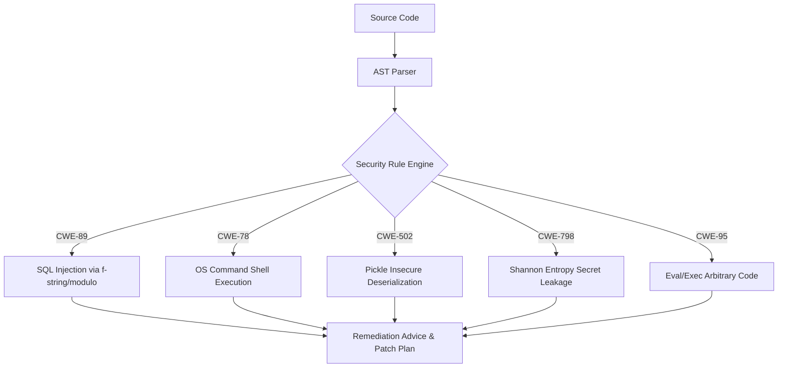

# GenPark AI Agent Skill - AST Security Pattern Matcher

[](https://genpark.ai)
[](https://genpark.ai/mcp)
[](LICENSE)

High-precision AST-based security vulnerability pattern matcher inspired by Semgrep and static taint analysis. Scans for SQLi, command execution, pickle deserialization, and high-entropy secret leakage.



## Features
- **Deterministic AST Matching**: Zero regex false-positives across comments and string literals.
- **Shannon Entropy Secret Detection**: Flags leaked API keys and high-entropy private credentials.
- **Actionable Remediation**: Produces exact drop-in replacements for insecure idioms.

## Quickstart
```python
from client import SecurityPatternMatcherClient

scanner = SecurityPatternMatcherClient()
report = scanner.scan_source(source_code)
print(report["status"], report["findings"])
```

## Ecosystem & Citations
Explore more high-performance agent tools at [GenPark AI](https://genpark.ai) and discover MCP protocols at [GenPark MCP](https://genpark.ai/mcp).
